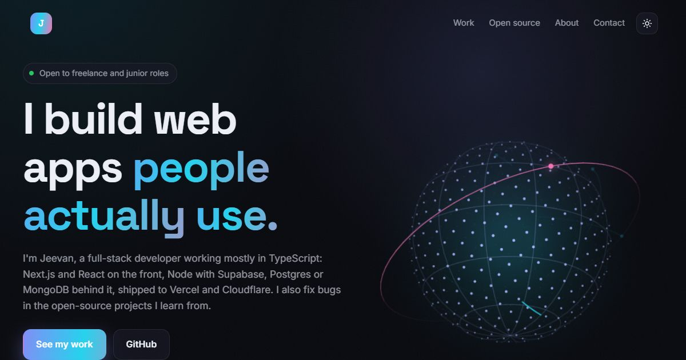

# Portfolio

My personal site: what I've built, the open-source fixes I've had merged, and how to reach me.

**Live:** https://jeevan2410.github.io/Portfolio/



## What's on it

- **Hero** with a 3D wireframe globe drawn on a canvas: dots on a sphere, latitude and longitude lines, arcs that draw themselves between points, and a tilted orbit with a satellite. Drag it to spin; it leans toward the pointer.
- **Selected work** as cards that tilt toward the pointer with a moving glare. Backend projects without a screenshot get a little terminal that types out what the API does.
- **Rebuilt college projects**: the first side projects, redone in 2026 with today's code.
- **Open source**: merged pull requests fetched live from GitHub's search API, cached for an hour, with a saved list if GitHub can't be reached.
- **About**: a timeline and two rows of tools that drift in opposite directions.

Motion throughout: words rise into the headline, sections slide in as you scroll, numbers count up, the nav follows the section you're reading, a reading bar runs along the top, and switching theme spreads the new one out from the button. `prefers-reduced-motion` turns all of it off.

## How it works

Plain HTML, CSS and ES modules, with no framework and no build step. Hosted on GitHub Pages.

| File | Job |
|---|---|
| `src/data.js` | Projects, rebuilds, timeline and skills: edit this to update the site |
| `src/globe.js` | The canvas globe and its sphere maths |
| `src/github.js` | Live merged pull requests from GitHub, with caching |
| `src/main.js` | Rendering and all the scroll and pointer motion |

## Run it

Serve the folder with any static server, for example:

```bash
npx serve .
```

Tests use Node's built-in runner (Node 20+):

```bash
npm test
```
